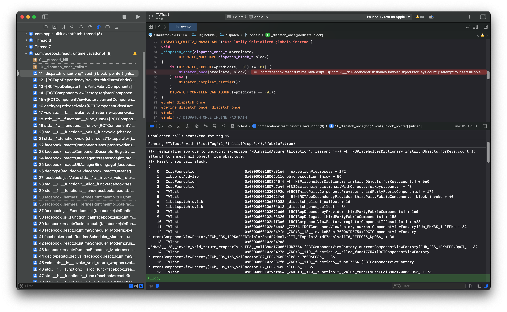

# Example RNTV app
### Reproduces crash in [#889](https://github.com/react-native-tvos/react-native-tvos/issues/889)

A crash may occur in the New Architecture because Codegen is including packages that do not support tvOS. The New Architecture uses a different code generator provider than the Legacy Architecture. During the transition to the New Architecture, a macro was introduced to wrap the Objective-C code, preventing it from running on unsupported platforms. However, when the New Architecture code generator provider was later refactored into a static template, this change was inadvertently lost.

##### Related:
- https://github.com/facebook/react-native/pull/42047
- https://github.com/facebook/react-native/pull/47518

Here is a [patch](https://github.com/cgoldsby/RNTV-889/edit/main/README.md#fix) that adds the Macros to the New Architecture codegen.

<br />

#### Run the tvOS app using the New Architecture
:x: The app will crash when running the RNTV app using the **New Architecture**.
```shell
yarn ios --simulator "Apple TV"
```


##### Fix:
After reproducing the crash, apply patch to fix:
```shell
git apply patches/react-native+0.77.2-0.patch
```

<br />

#### Run the tvOS using the Legacy Architecture
✅ App launches without error on Apple TV when using the **Legacy Architecture**.
```shell
RCT_NEW_ARCH_ENABLED=0 yarn ios --simulator "Apple TV"
```


<br />

#### Run the RNTV on Android TV
✅ App launches without error on Android TV when using **Legacy** or **New Architecture**.
```shell
yarn android
```

